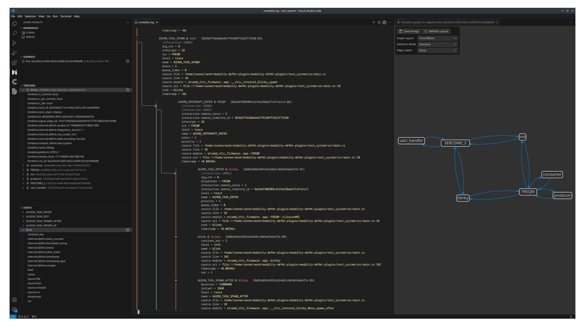

# modality-defmt-plugins &emsp; ![ci] [![crates.io]](https://crates.io/crates/modality-defmt-plugins)

A [Modality][modality] reflector plugin suite and ingest adapter library for Ferrous Systems's [defmt][defmt] data.



## Getting Started

1. Follow the instructions in the [Setup](https://defmt.ferrous-systems.com/setup) section of the [defmt book][defmt].
2. Use the importer to import from a data file or pipe, or use one of the available collectors to collect data from a running system.

See the [test system](test_system/) for a complete example.

## Adapter Concept Mapping

The following describes the default mapping between [defmt][defmt] concepts
and [Modality's][modality] concepts. See the configuration section for ways to change the
default behavior.

* Log messages are represented as events on the default timeline ('main'), unless using RTOS mode.
* Log message details are represented as event attributes at the root
  level (e.g. `event.level = trace` for `trace!` messages).
* Other [defmt][defmt]-specific information is represented as event and timeline attributes with
  the prefix `event.internal.defmt` and `timeline.internal.defmt` respectively.
* Event names will use the log message's formatted string by default, and can be overridden using the
  conventions described below.

See the [Modality documentation](https://docs.auxon.io/modality/) for more information on the Modality concepts.

## Format String Conventions

The plugins will look for a specific convention in order to extract more semantically rich information
from the log messages to produce [Modality][modality] attribute key/value pairs.

The format string syntax is `[<event_name>::][<attr_key>=<attr_val>,...]`.

* When `<event_name>` is not present, the formatted string is used as the event name.
* `<attr_val>` can be a literal or parameter.
* `<attr_val>` only supports primitive types (e.g. integer/string/etc)

For example, the statement `defmt::info!("my_event::k0={=u8},k1=something,k2={=str}", 2, "foo");`
will produce an event with the following attributes (not exhaustive):
* `event.name = my_event`
* `event.k0 = 2`
* `event.k1 = "something"`
* `event.k2 = "foo"`

## Configuration

All of the plugins can be configured through a TOML configuration file (from either the `--config` option or the `MODALITY_REFLECTOR_CONFIG` environment variable).
All of the configuration fields can optionally be overridden at the CLI, see `--help` for more details.

See the [`modality-reflector` Configuration File documentation](https://docs.auxon.io/modality/ingest/modality-reflector-configuration-file.html) for more information
about the reflector configuration.

### Common Sections

These sections are the same for each of the plugins.

* `[ingest]` — Top-level ingest configuration.
  - `additional-timeline-attributes` — Array of key-value attribute pairs to add to every timeline seen by the plugin.
  - `override-timeline-attributes` — Array of key-value attribute pairs to override on every timeline seen by this plugin.
  - `allow-insecure-tls` — Whether to allow insecure connections. Defaults to `false`.
  - `protocol-parent-url` — URL to which this reflector will send its collected data.

* `[metadata]` — Plugin configuration table.
  - `client-timeout` — Specify a [modality-sdk][modality-sdk] client timeout. Accepts durations like "10ms" or "1minute 2seconds 22ms".
  - `run-id` — Use the provided string as the run ID instead of generating a random one.
  - `clock-id` — Use the provided string as the clock ID instead of generating a random one.
  - `init-task-name` — Use the provided initial task/context name instead of the default (`main`).
  - `disable-interactions` — Don't synthesize interactions between tasks and ISRs when a context switch occurs, when in RTOS mode.
  - `rtos-mode` — The RTOS mode to use. The default is none.
  - `elf-file` — The ELF file containing the [defmt][defmt] symbol information.

### Importer Section

These `metadata` fields are specific to the importer plugin.

Note that individual plugin configuration goes in a specific table in your
reflector configuration file, e.g. `[plugins.ingest.importers.defmt.metadata]`.

* `[metadata]` — Plugin configuration table.
  - `open-timeout` — Specify an open-file retry timeout. Accepts durations like "10ms" or "1minute 2seconds 22ms".
  - `file` — Path to the file to import.

### RTT Collector Section

These `metadata` fields are specific to the streaming RTT collector plugin.

Note that individual plugin configuration goes in a specific table in your
reflector configuration file, e.g. `[plugins.ingest.collectors.defmt-rtt.metadata]`.

* `[metadata]` — Plugin configuration table.
  - `attach-timeout` — Specify a target attach timeout.
    When provided, the plugin will continually attempt to attach and search for a valid
    RTT control block anywhere in the target RAM.
    Accepts durations like "10ms" or "1minute 2seconds 22ms".
    See the [RTT timing section](https://docs.rs/probe-rs-rtt/0.14.2/probe_rs_rtt/struct.Rtt.html#examples-of-how-timing-between-host-and-target-effects-the-results) for more information.
  - `control-block-address` —  Use the provided RTT control block address instead of scanning the target memory for it.
  - `up-channel` — The RTT up (target to host) channel number to poll on. The default value is 0.
  - `probe-selector` — Select a specific probe instead of opening the first available one.
  - `chip` — The target chip to attach to (e.g. `STM32F407VE`).
  - `protocol` — Protocol used to connect to chip. Possible options: [`swd`, `jtag`]. The default value is `swd`.
  - `speed` — The protocol speed in kHz. The default value is 4000.
  - `core` — The selected core to target. The default value is 0.
  - `reset` — Reset the target on startup.
  - `chip-description-path` — Provides custom target descriptions based on CMSIS Pack files.
    See the [probe-rs target extraction](https://probe.rs/docs/knowledge-base/cmsis-packs/#target-extraction) section for
    more information.

### RTOS Mode

The plugins can be configured to look for RTOS-specific instrumentation to determine
task/ISR contexts and interactions.

Currently the only supported RTOS mode is `rtic1`.
It requires using our [RTIC fork](https://github.com/auxoncorp/cortex-m-rtic/tree/defmt-instrumentation)
(based on version 1.1.4) with trace instrumentation.
You can try it out by adding the follwing to your `Cargo.toml`:
```toml
[dependencies.cortex-m-rtic]
git = "https://github.com/auxoncorp/cortex-m-rtic.git"
branch = "defmt-instrumentation"
```

## LICENSE

See [LICENSE](./LICENSE) for more details.

Copyright 2024 [Auxon Corporation](https://auxon.io)

Licensed under the Apache License, Version 2.0 (the "License");
you may not use this file except in compliance with the License.
You may obtain a copy of the License at

[http://www.apache.org/licenses/LICENSE-2.0](http://www.apache.org/licenses/LICENSE-2.0)

Unless required by applicable law or agreed to in writing, software
distributed under the License is distributed on an "AS IS" BASIS,
WITHOUT WARRANTIES OR CONDITIONS OF ANY KIND, either express or implied.
See the License for the specific language governing permissions and
limitations under the License.

[ci]: https://github.com/auxoncorp/modality-defmt-plugins/workflows/CI/badge.svg
[crates.io]: https://img.shields.io/crates/v/modality-defmt-plugins.svg
[defmt]: https://defmt.ferrous-systems.com/
[modality]: https://auxon.io/products/modality
[modality-sdk]: https://github.com/auxoncorp/auxon-sdk
